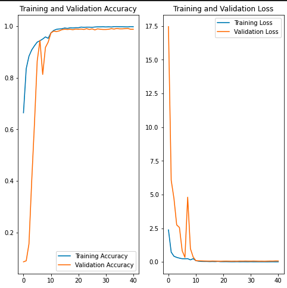
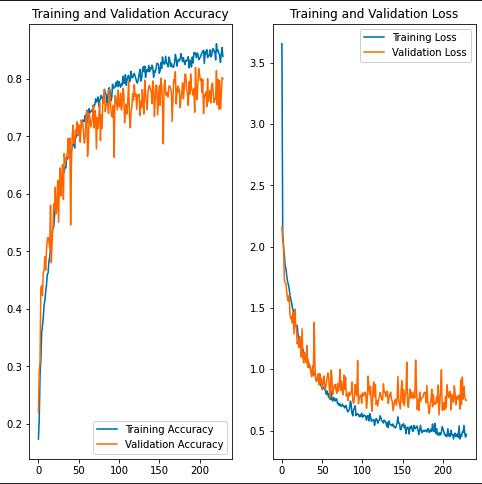

<!-- PROJECT LOGO -->
<br />
<p align="center">
  <a href="https://github.com/Fundamentals-of-Machine-Learning-F21/final-project---code-report-uf-europe">
    
  </a>

  <h3 align="center">Image Classifier Project</h3>

  <p align="center">
    The README to the Image Classifying Project
    <br />
    <a href="https://github.com/Fundamentals-of-Machine-Learning-F21/final-project---code-report-uf-europe/Report UF Europe.doc"><strong>Explore the docs »</strong></a>
    <br />
    <br />
    <a href="https://github.com/Fundamentals-of-Machine-Learning-F21/final-project---code-report-uf-europe/issues">Report Bug</a>
    ·
    <a href="https://github.com/Fundamentals-of-Machine-Learning-F21/final-project---code-report-uf-europe/issues">Request Feature</a>
  </p>
</p>


<!-- TABLE OF CONTENTS -->
<details open="open">
  <summary>Table of Contents</summary>
  <ol>
    <li>
      <a href="#about-the-project">About The Project</a>
    </li>
    <li>
      <a href="#getting-started">Getting Started</a>
      <ul>
        <li><a href="#dependencies">Dependencies</a></li>
        <li><a href="#installation">Installation</a></li>
      </ul>
    </li>
    <li><a href="#usage">Usage</a></li>
    <li><a href="#roadmap">Roadmap</a></li>
    <li><a href="#contributing">Contributing</a></li>
    <li><a href="#license">License</a></li>
    <li><a href="#authors">Authors</a></li>
    <li><a href="#acknowledgements">Acknowledgements</a></li>
  </ol>
</details>


<!-- ABOUT THE PROJECT -->
## About The Project

This Git Repo containes an Image Classifying Project which can classify images from 10 different classes with an accuracy of over 98.8%.

This project includes a classifier built on [RESNET50](https://arxiv.org/pdf/1512.03385v1.pdf) and a classifier, built from scratch, which classifies images with an accuracy of over 76%<br>
<figure>
    
    <figcaption>Figure above shows retrained RESNET50 Accuracy</figcaption>
  
  <figcaption>Figure above shows Custom Neural Network accuracy</figcaption>
</figure>

The retrained ResNet50 features data augmentation techniques, and condenses the layers at the end to the number of classes it is trained for. The training first is in bigger steps and then for fine tuning the learning rate is 1/10 of the original learning rate. It then also begins tuning the top 100 layers of the ResNet50.

The custom Neural network uses a series of data augmentation techniques, pooling layers, 2 Convolution Layers and condenses the model at the end to the number of classes. It also features multiple Dropouts between the layers to prevent overfitting.


<!-- GETTING STARTED -->
## Getting Started

### Dependencies

Here, list all libraries, packages and other dependencies that need to be installed to run your project. Include library versions and how they should be installed if a special requirement is needed.

For example, this is how you would list them:
* Numpy 1.21.4
  ```sh
  conda install -c conda-forge numpy
  ```
* Tensorflow 2.6.0
  ```sh
  conda install -c conda-forge tensorflow
  ```
* Matplotlib 3.5.0
  ```sh
  conda install -c conda-forge matplotlib
  ```

### Installation

1. Clone the repo
   ```sh
   git clone https://github.com/Fundamentals-of-Machine-Learning-F21/final-project---code-report-uf-europe
   ```

<!-- USAGE EXAMPLES -->
## Usage

Included in the Notebook are 2 functions, which create image classifier models: 
- build_retrained_model

  With following parameters used:
  ```
    batch_size = 32
    img_height = 224
    img_width = 224
    data_dir = 'KerasPrep'
    validation_split = 0.2
    random_rotation = 0.35
    random_zoom = 0.35
    dropout = 0.24
    epochs=10
    base_learning_rate = 0.0001
  ```
- build_custom_model

  With following parameters used:
  ```
    batch_size = 32
    img_height = 300
    img_width = 300
    data_dir = 'KerasPrep'
    validation_split = 0.2
    random_rotation = 0.35
    random_zoom = 0.35
    dropout = 0.3
    dropout2 = 0.31
    start_neurons = 128
    number_of_layers = 2
    batch_normalization = False
    epochs=230
  ```

Also included in the notebook are cells, which are an example for how to use the model for precidicting the class.

```
img_array = tf.keras.utils.img_to_array(img)
img_array = tf.expand_dims(img_array, 0) # Create a batch

predictions = model.predict(img_array)
score = tf.nn.softmax(predictions[0])

print(
    "This image most likely belongs to {} with a {:.2f} percent confidence."
    .format(class_labels[np.argmax(score)], 100 * np.max(score))
)
```


<!-- ROADMAP -->
## Roadmap

See the [open issues](https://github.com/Fundamentals-of-Machine-Learning-F21/final-project---code-report-uf-europe/issues) for a list of proposed features (and known issues).

<!-- CONTRIBUTING -->
## Contributing

Contributions are what make the open source community such an amazing place to be learn, inspire, and create. Any contributions you make are **greatly appreciated**.

1. Fork the Project
2. Create your Feature Branch (`git checkout -b feature/AmazingFeature`)
3. Commit your Changes (`git commit -m 'Add some AmazingFeature'`)
4. Push to the Branch (`git push origin feature/AmazingFeature`)
5. Open a Pull Request


<!-- LICENSE -->
## License

Distributed under the MIT License. See `LICENSE` for more information.


<!-- Authors -->
## Authors


Hugo Chapado - hugochapado@ufl.edu


<!-- ACKNOWLEDGEMENTS -->
## Acknowledgements

You can acknowledge any individual, group, institution or service.
* [Catia Silva](https://faculty.eng.ufl.edu/catia-silva/)
* [GitHub Pages](https://pages.github.com)

## Thank you
